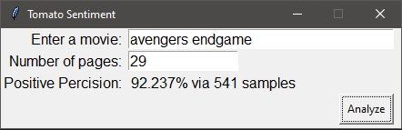

# TomatoSentiment
Scrapes Rotten Tomatoes movie reviews and runs a sentiment analysis. After analyzing each individual review the program will give a score. The sample size of the movie will determine how accurate the score will be. For exmaple, Avengers Engame has around 541 reviews and gives a positive polarity perceision of 92% which is close to Rotten Tomaotoes score of 94%. 

# How to use
- Download the chrome driver for selenium. https://sites.google.com/chromium.org/driver/
- On line 22 in the program change the path of the chrome driver to where you have it in your system.
- in the GUI enter the name of the movie simmilarly to how the link depicts it.
  - Example: "https://www.rottentomatoes.com/m/avengers_endgame" -> avengers endgame 
- in the GUI enter the max of pages plus one of the critic reviews. (non-inclusive)

# What I Learned
- polarity and objectivity in sentiment analysis 
- extracting information from multiple pages
- exporting information into a csv file 
- implementing multithreading

# Screenshots

